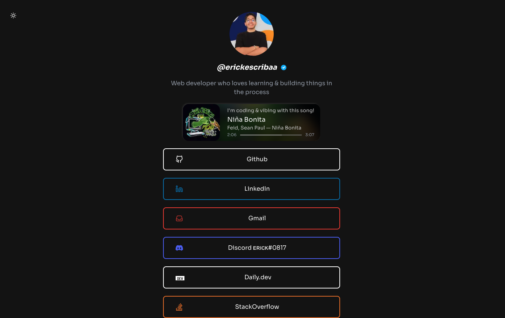

<!-- [![Contributors][contributors-shield]][contributors-url] -->

[![Forks][forks-shield]][forks-url] [![Stargazers][stars-shield]][stars-url]
[![Issues][issues-shield]][issues-url] [![MIT License][license-shield]][license-url]
[![LinkedIn][linkedin-shield]][linkedin-url]

<!-- PROJECT LOGO -->
<br />
<p align="center">
   <a href="https://erickescriba.vercel.app/">
    
  </a>

  <h3 align="center">Links</h3>

  <p align="center">
    Erick Escriba's social media links
  </p>
</p>

<br />

<!-- ABOUT THE PROJECT -->

### Built With

For this project I decided to use technologies that I am comfortable working with, in order to keep
development time to a minimum, which are:

- [Nextjs](https://nextjs.org/)
- [TypeScript](https://www.typescriptlang.org/)
- [styled-components](https://styled-components.com/)

<!-- GETTING STARTED -->

## Getting Started

### Prerequisites

- npm
  ```sh
  npm install npm@latest -g
  ```

### Installation

1. Clone the repo
   ```sh
   git clone https://github.com/aireck2/st-links.git
   ```
2. Install NPM packages
   ```sh
   npm install
   ```
3. Run project
   ```sh
   npm run dev
   ```

<!-- USAGE EXAMPLES -->

<!-- ## Usage

Use this space to show useful examples of how a project can be used. Additional screenshots, code
examples and demos work well in this space. You may also link to more resources.

_For more examples, please refer to the [Documentation](https://example.com)_ -->

<!-- ROADMAP -->

## Roadmap

See the [open issues](https://github.com/aireck2/st-links/issues) for a list of proposed
features (and known issues).

<!-- CONTRIBUTING -->

## Contributing

Contributions are what make the open source community such an amazing place to be learn, inspire,
and create. Any contributions you make are **greatly appreciated**.

Please contribute using [Github Flow](https://guides.github.com/introduction/flow/). Create a
branch, add commits, and [open a pull request](https://github.com/aireck2/st-links/compare/).

<!-- 1. Fork the Project
2. Create your Feature Branch (`git checkout -b feature/AmazingFeature`)
3. Commit your Changes (`git commit -m 'Add some AmazingFeature'`)
4. Push to the Branch (`git push origin feature/AmazingFeature`)
5. Open a Pull Request -->

<!-- LICENSE -->

## License

Distributed under the MIT License. See `LICENSE` for more information.

<!-- CONTACT -->

## Contact

Erick Escriba - [@erickescribaa](https://twitter.com/erickescribaa) - erickescribaa@gmail.com

Project Link: [https://github.com/aireck2/st-links](https://github.com/aireck2/st-links)

<!-- ACKNOWLEDGEMENTS -->

## Acknowledgements

- [Img Shields](https://shields.io)
- [Choose an Open Source License](https://choosealicense.com)
- [Vercel](https://pages.github.com)
  <!-- - [Loaders.css](https://connoratherton.com/loaders) -->
  <!-- - [Slick Carousel](https://kenwheeler.github.io/slick) -->
  <!-- - [Smooth Scroll](https://github.com/cferdinandi/smooth-scroll) -->
  <!-- - [Sticky Kit](http://leafo.net/sticky-kit) -->

<!-- MARKDOWN LINKS & IMAGES -->
<!-- https://www.markdownguide.org/basic-syntax/#reference-style-links -->

[contributors-shield]: https://img.shields.io/github/contributors/aireck2/st-links.svg?style=for-the-badge
[contributors-url]: https://github.com/aireck2/st-links/graphs/contributors
[forks-shield]: https://img.shields.io/github/forks/aireck2/st-links.svg?style=for-the-badge
[forks-url]: https://github.com/aireck2/st-links/network/members
[stars-shield]: https://img.shields.io/github/stars/aireck2/st-links.svg?style=for-the-badge
[stars-url]: https://github.com/aireck2/st-links/stargazers
[issues-shield]: https://img.shields.io/github/issues/aireck2/st-links.svg?style=for-the-badge
[issues-url]: https://github.com/Aireck2/st-links/issues
[license-shield]: https://img.shields.io/github/license/aireck2/st-links.svg?style=for-the-badge
[license-url]: https://github.com/aireck2/links-next/blob/main/LICENSE
[linkedin-shield]: https://img.shields.io/badge/-LinkedIn-black.svg?style=for-the-badge&logo=linkedin&colorB=555
[linkedin-url]: https://linkedin.com/in/erickescriba
[product-screenshot]: images/screenshot.png
